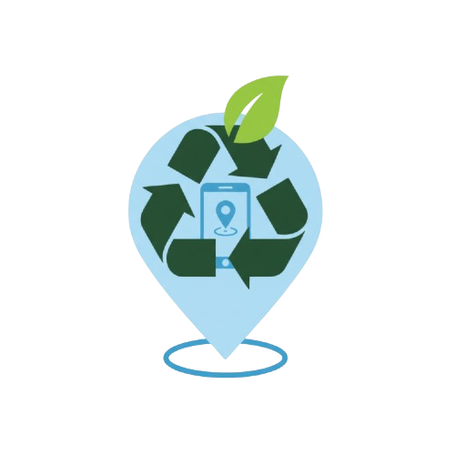

#Proyecto de Fin de Curso Desarrollo de Sistemas Móviles-2025-2 - UNMSM
---
##Docente
- Mamani Rodriguez, Zoraida Emperatriz

##Integrantes
1. Guzman Morales, Deysi Emely
2. Lopez Sanchez, Farid Sebastián
3. Ortega Sayago, Diego

---

#Detalles de la App

El presente proyecto se basa en el desarrollo de una aplicación móvil de reciclaje inteligente, orientada a fomentar prácticas sostenibles mediante el uso de tecnologías móviles e inteligencia artificial. La aplicación ya implementa funcionalidades que permiten a los usuarios identificar, clasificar y registrar residuos reciclables, como también centros de reciclajes de manera sencilla, otorgando incentivos a través de un sistema de puntos y gamificación que promueve la participación activa.
Para lograrlo, se integraron modelos de análisis de imagen que facilitan la detección automática de materiales, APIs de maps para ubicar puntos de reciclaje cercanos, el uso de Gemini como motor de busqueda, y dashboards interactivos que permiten visualizar métricas de participación y resultados en tiempo real.

---

##Tecnologías Utilizadas
- **Modelos de análisis de imagen** para la detección automática de materiales reciclables y centros de reciclaje.  
- **APIs de maps** para ubicar y registrar puntos de reciclaje cercanos.  
- **Gemini** como motor de búsqueda para noticias sobre reciclaje.  
- **Dashboards interactivos** para visualizar métricas de participación y resultados en tiempo real.  
- **Gamificación** para incentivar la participación de los usuarios.
